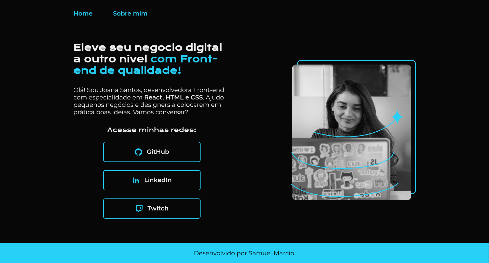
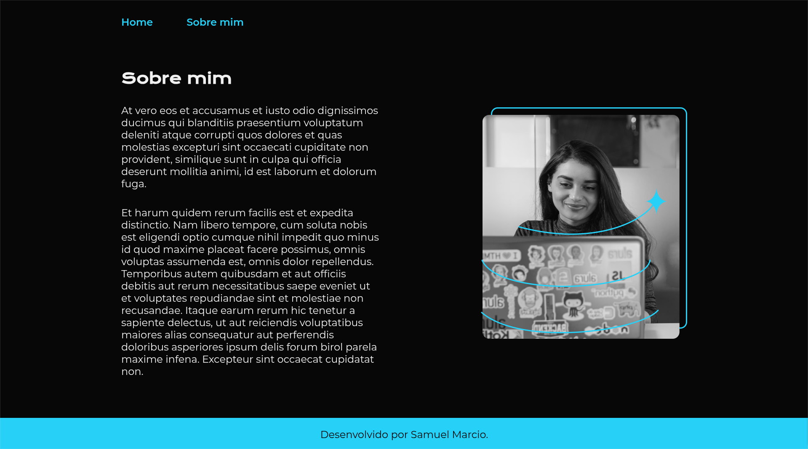

# Portifolio Joana Santos v1

Segunda versao do projeto desenvolvido ao longo do curso de HTML e CSS da Alura.





## Como Configurar o Projeto

Siga estas etapas para configurar e rodar o projeto em outra máquina.

### Pré-requisitos
- Certifique-se de que o **Node.js** está instalado. Você pode verificar executando:
  ```sh
  node -v
  ```
  Se não estiver instalado, baixe-o em [nodejs.org](https://nodejs.org/).

### 1. Acesse a pasta do projeto
```sh
cd <root-repositorio-Cursos-Alura>/portifolio-html-css-curso3
```

### 2. Instalar Dependências
Como a pasta `node_modules/` não está incluída no repositório, instale as dependências:
```sh
npm install
```
Ou, se estiver usando Yarn:
```sh
yarn install
```
Ou com pnpm:
```sh
pnpm install
```

### 3. Rodar o Servidor de Desenvolvimento
Inicie o servidor Vite:
```sh
npm run dev
```
Ou com Yarn:
```sh
yarn dev
```
Ou com pnpm:
```sh
pnpm dev
```

Isso iniciará um servidor local, e você verá a saída com um URL (ex.: `http://localhost:5173/`).

---

Agora seu projeto deve estar funcionando! 🚀
